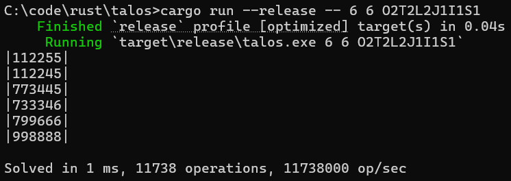

# talos
Brute force solver for "The Talos Principle" game puzzles.
## Usage
Need to provide field size and list of [tetrominoes](https://tetris.fandom.com/wiki/Tetromino).

In example for this game puzzle:

Use this command line arguments: `6 6 O2T2L2J1I1S1`

In result each tetromino is shown with its own digit:

